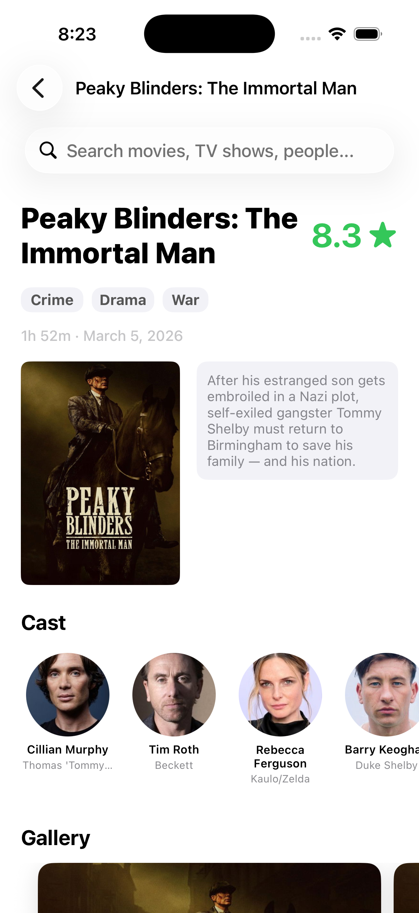
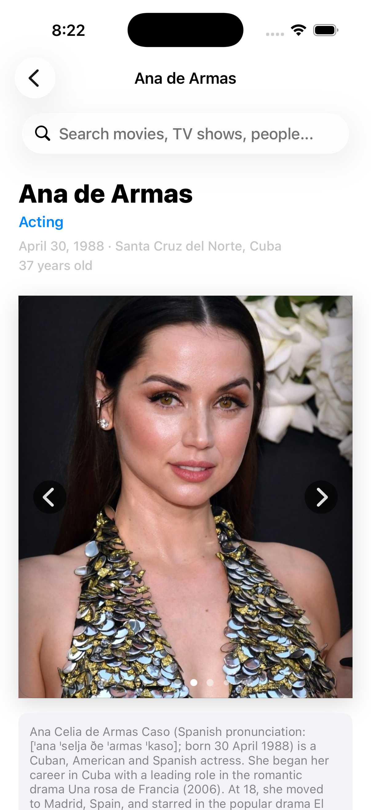

# CineScope
> Search and explore movies, TV series, and people — powered by TMDB — with fast results and rich detail pages.

---

## 📱 Preview

  

| Media Detail | Person Detail |
| :---: | :---: |
|  |  |

---

## 🚀 Key Features
* **Multi-search (Movie / TV / Person):** One query returns mixed results and routes to the correct detail experience.
* **Rich detail screens:** Movie/Series pages include metadata, top cast, and a backdrop gallery; Person pages include biography and an image carousel.
* **Polished UX:** Scroll-to-hide search bar, keyboard dismiss-on-drag, and async image loading for smooth browsing.
* **Genre caching:** Genre mappings are persisted with Core Data and refreshed periodically to keep lookups fast and offline-friendly.

---

## 🛠 Tech Stack & Architecture
* **Language:** Swift 5
* **UI Framework:** UIKit (programmatic UI + Auto Layout)
* **Architecture:** MVVM-ish (View Controllers + Views) with a service layer and dependency injection for testability
* **Concurrency:** Swift Concurrency (async/await + `Task`)
* **Data Persistence:** Core Data (plus UserDefaults for last refresh timestamp)
* **Networking:** URLSession (TMDB v3 API)
* **Dependency Manager:** None (no SPM/CocoaPods dependencies)

---

## 🧠 Technical Challenges & Learnings
* **Challenge:** Keeping search + multiple detail screens responsive while fetching extra data (details, credits, images) on-demand.
* **Solution:** Built a small service layer with async/await endpoints, injected services into the view model for testability, and updated UI via lightweight callbacks.
* **Learning:** Clear separation (service ↔️ view model ↔️ UI) makes it easier to iterate on UI/UX without rewriting networking or persistence.

---

## ⚙️ Requirements & Installation
* iOS 26+
* Xcode 17+

1. Clone the repository:
   - `git clone https://github.com/keyursavalia/CineScope.git`
2. Add your TMDB API token:
   - Create `MovieApp/Configuration/APIKey.plist`
   - Add a string key named `TMDB_API_TOKEN` with your TMDB v4 access token (without the `Bearer ` prefix)
3. Open `MovieApp.xcodeproj`
4. Select a simulator and press **Cmd + R**

---

## ✍️ Author
* **Keyur Savalia** - [LinkedIn](https://www.linkedin.com/in/keyursavalia)

